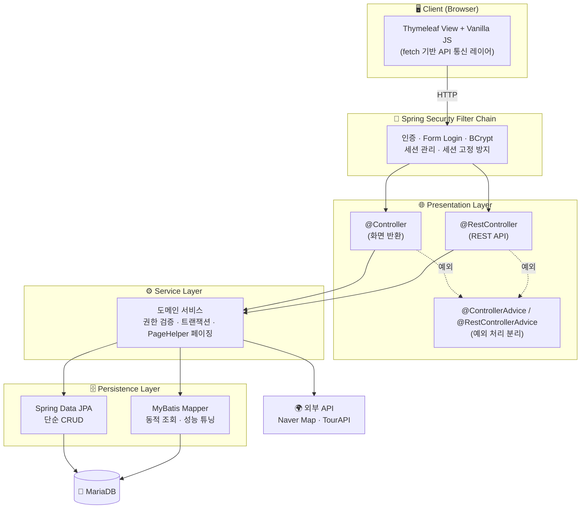
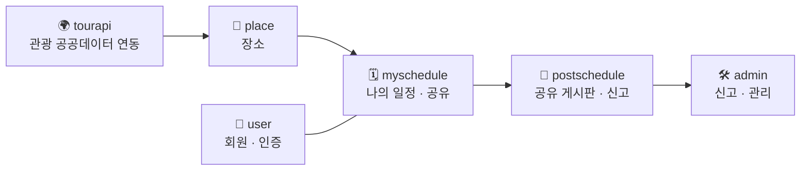

# LetsGo ✈️ — 여행 일정 계획·공유 플랫폼

> 여행 일정을 만들고 동선·예산·할일을 관리하며, 동반자와 공유하거나 게시판에 공개할 수 있는 웹 서비스.
> **레거시(Servlet/JSP) 구조를 Spring Boot 아키텍처로 리팩토링**하며, *"어떤 기술을 왜 쓰는가"*를 트레이드오프로 결정한 프로젝트입니다.

<p>
  
  
  
  
  
  
  
</p>

---

## 📌 프로젝트 개요

| 항목 | 내용 |
|------|------|
| 개발 형태 | 팀 프로젝트 · 애자일(스프린트) 기반 · *(개발 기간: `YYYY.MM ~ YYYY.MM` — 채워넣기)* |
| 담당 역할 | **마이일정(MySchedule) 도메인 풀스택** — 일정/동선/예산/할일/동반자 공유, 조회 성능 최적화, 리소스 인가 |
| 진행 방식 | **1차 스프린트** Servlet/JSP → **2차 스프린트** Spring Boot 리팩토링 (계층형 아키텍처 전환) |

---

## 🏗️ 아키텍처

### 계층형 아키텍처 (Layered Architecture)



### 도메인 모듈 구성 (Domain-Driven Packaging)

> 기술이 아닌 **도메인 단위로 패키지 경계**를 그어, 변경의 영향 범위를 한 도메인으로 응집시켰습니다. (→ MSA 분리 가능한 구조)



각 도메인은 `controller(View/REST) · service · repository · vo` 로 계층을 분리합니다.

---

## 🛠️ 기술 스택

| 구분 | 기술 |
|------|------|
| **Language** | Java 17 |
| **Backend** | Spring Boot 3.5, Spring MVC, Spring Security 6 |
| **Persistence** | Spring Data JPA (Hibernate), MyBatis, **PageHelper 2.1** (MyBatis Interceptor) |
| **Database** | MariaDB |
| **View / Front** | Thymeleaf, thymeleaf-extras-springsecurity6, Vanilla JS, SortableJS |
| **External API** | Naver Maps, TourAPI(관광 공공데이터) |
| **Build / Test** | Maven, JUnit5, mybatis-spring-boot-starter-test |

---

## ✨ 핵심 기능

- **회원/인증** — 회원가입, 로그인(BCrypt), 아이디·비밀번호 찾기, 권한별 접근 제어(USER/ADMIN)
- **마이일정** — 일정 생성·수정·삭제, 방문지 동선(드래그 정렬), 예산/할일 관리, **동반자 공유(읽기/편집 권한)**, 지도 시각화
- **공유 게시판** — 일정을 게시판에 공유, 좋아요, 신고
- **장소/관광정보** — TourAPI 공공데이터 연동으로 장소 데이터 구축
- **관리자** — 신고 관리 등 운영 기능

---

## 🧩 아키텍처 의사결정 & 트러블슈팅

> 이 프로젝트의 핵심은 기능 구현이 아니라 **"왜 이 구조인가"를 트레이드오프로 결정한 과정**입니다.

### 1. 조회 성능 — 쿼리를 건드리지 않고 DB 레벨 페이징
- **문제**: 목록 조회가 전체 행을 가져와 애플리케이션에서 잘라내는 구조 → 데이터 증가 시 메모리·I/O 낭비. 항목별 컬럼을 반복 조회하는 **N+1 문제**.
- **결정**: 여러 화면이 공유하는 매퍼 SQL을 최소 수정하기 위해 **PageHelper(MyBatis Interceptor)** 도입. `startPage`로 서비스 레이어에서 `LIMIT/COUNT` 자동 적용, N+1은 `GROUP BY / JOIN`으로 제거, 조회·정렬 컬럼에 인덱스 고려.
- **효과**: 데이터가 늘어도 일관된 조회 성능. 응답은 `PageResponse<T>`로 표준화해 페이지 계산을 일원화.

### 2. 영속성 전략 — JPA와 MyBatis의 역할 분리
- **문제**: 한 방식만 쓰면 *생산성(JPA)* 과 *SQL 통제(MyBatis)* 중 하나를 포기.
- **결정**: 단순 CRUD는 **JPA**, 다중 조인·동적 조건으로 튜닝이 필요한 조회는 **MyBatis**로 분리 배치.
- **효과**: 생산성과 성능 제어를 동시에 확보.

### 3. 리소스 인가 — 인증 너머의 접근 통제 (IDOR 방지)
- **문제**: URL을 인증으로만 막으면 로그인 사용자가 **권한 없는 남의 일정에 직접 접근**하는 인가 공백(Broken Access Control).
- **결정**: Spring Security로 URL 인증을 두되, **서비스 계층에서 소유자·공유 권한을 쿼리로 검증**하고 일원화. `존재하지 않음`과 `권한 없음`을 같은 응답으로 묶어 리소스 존재 여부 노출 차단.
- **효과**: 정상 공유자는 접근, 무단 접근은 403 차단.

### 4. 예외 처리 — API와 화면 응답 계약 분리
- **문제**: 같은 예외가 API(JSON)·화면(HTML) 요청에 뒤섞여 응답 포맷 불일치.
- **결정**: `@RestControllerAdvice`(JSON) 와 `@ControllerAdvice`(에러 페이지)를 **컨트롤러 타입별로 분리**, 도메인 예외를 HTTP 상태에 매핑.
- **효과**: 클라이언트 유형에 맞는 일관된 에러 응답, 컨트롤러의 try-catch 제거.

### 5. 프론트엔드 — 통신 계층 추상화 & 관심사 분리
- **문제**: 화면 스크립트에 네트워크·상태·UI 로직이 뒤엉켜 유지보수 곤란.
- **결정**: 모든 `fetch` 호출을 **API 레이어(모듈)로 추상화**하고, 기능별로 파일을 분리(SoC).
- **효과**: UI는 "무엇을 호출할지"만 알고, 통신은 한 모듈이 담당 → 변경 범위 축소.

---

## 📂 프로젝트 구조

```
src/main/java/com/travel/letsgospringboot
├── admin         # 신고/관리
├── myschedule    # 나의 일정 · 공유 (담당)
│   ├── controller  (View + REST)
│   ├── service
│   ├── repository  (JPA + MyBatis Mapper)
│   └── vo
├── place         # 장소
├── postschedule  # 공유 게시판
├── tourapi       # 관광 공공데이터 연동
├── user          # 회원 · 인증 (auth: SecurityConfig, UserDetails)
├── common        # PageResponse 등 공통
├── advice        # RestExceptionHandling / ViewExceptionHandling
└── exception     # 도메인 커스텀 예외

src/main/resources
├── mappers        # MyBatis XML (myScheduleMapper.xml 등)
├── templates/html # Thymeleaf
└── static/js      # 프론트 (도메인별 분리 + API 레이어)
```

---

## 🚀 실행 방법

```bash
# 1. MariaDB 준비 후 접속 정보 설정
#    src/main/resources/application.yaml 의 datasource / API Key 설정

# 2. 빌드 & 실행 (JDK 17 필요)
./mvnw spring-boot:run

# 3. 접속
#    http://localhost:8080
```

> `application.yaml` 에 DB 접속 정보, Naver Map / TourAPI 키가 필요합니다.

---

## 🔎 회고 — 무엇을 배웠나

- 레거시(JSP/JDBC)를 프레임워크로 **점진적으로 리팩토링**하며, 큰 변경을 스프린트·테스트로 안전하게 통제하는 법을 익혔습니다.
- 특정 프레임워크 사용법이 아니라 **"기술이 왜 그렇게 동작해야 하는가"** 를 먼저 이해하고, 상황에 맞는 기술을 **의사결정**하는 관점을 길렀습니다.

<!--
📝 채워넣을 것:
- 개발 기간 / 팀 구성(인원·역할)
- 실제 서비스 스크린샷 (docs/ 폴더에 이미지 추가 후  삽입)
- ERD 이미지 (있다면 docs/erd.png 로 추가)
- 저장소 URL / 배포 URL (있다면)
-->
