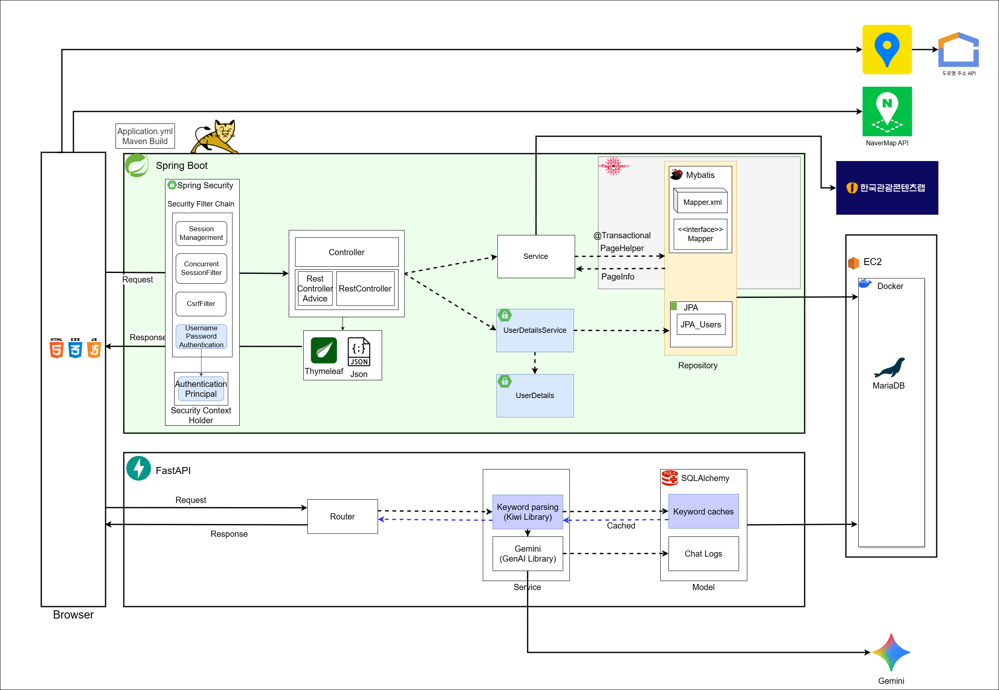

# LetsGo ✈️ — 여행 일정 계획·공유 플랫폼

> 여행 일정을 만들고 동선·예산·할일을 관리하며, 동반자와 공유하거나 게시판에 공개할 수 있는 웹 서비스.
> **1차 스프린트의 레거시(Servlet/JSP) 구조를 Spring Boot 계층형 아키텍처로 리팩토링**하고, AI 챗봇(FastAPI)을 연동한 2차 스프린트 프로젝트입니다.

<p>
  
  
  
  
  
  
  
  
</p>

---

## 📌 프로젝트 개요

| 항목 | 내용 |
|------|------|
| **개발 기간** | 2차 스프린트 · **2025.05.26 ~ 2025.06.15** (약 3주) |
| **개발 형태** | 팀 프로젝트 · 애자일(스프린트) 기반 · GitHub Flow 협업 |
| **진행 방식** | **1차 스프린트** Servlet/JSP → **2차 스프린트** Spring Boot 리팩토링 + AI 챗봇 연동 |
| **핵심 목표** | Spring 아키텍처로의 구조 전환 · 조회 성능 최적화 · 리소스 단위 인가 · 외부 API/AI 연동 |
|**1차 스프린트**  | https://github.com/sinee0601/letsgo-1st|


---

## 🏗️ 시스템 아키텍처



전체 시스템은 SSR 중심의 **Spring Boot 애플리케이션 서버**와 **FastAPI 기반 AI 챗봇 서버**로 구성되며, 모두 **AWS EC2 위 Docker 컨테이너**로 배포되고 **MariaDB**를 공유합니다. 

### ⚙️ Spring Boot (핵심 애플리케이션)

| 계층 | 구성 요소 | 역할 |
|------|-----------|------|
| **Security** | Spring Security Filter Chain | 세션 관리 · 동시 세션 제어 · CSRF · Form Login · `AuthenticationPrincipal` |
| **Presentation** | `@Controller` / `@RestController` / `@(Rest)ControllerAdvice` | 화면(Thymeleaf) 반환 · REST(JSON) API · 예외 처리 분리 |
| **Service** | 도메인 서비스 | `@Transactional` · 권한 검증 · PageHelper/PageInfo 페이징 |
| **Persistence** | Spring Data JPA · MyBatis Mapper | JPA는 단순 CRUD, MyBatis는 동적 조회·성능 튜닝으로 **역할 분리** |

### 🤖 FastAPI (AI 챗봇)

- **Kiwi** 형태소 분석으로 사용자 질의에서 키워드를 파싱하고, **Gemini(GenAI)** 로 여행 관련 응답을 생성
- **SQLAlchemy** 로 키워드 캐시(Keyword caches)와 대화 로그(Chat Logs)를 관리하여, 캐시 히트 시 Gemini 호출 없이 빠르게 응답
- https://github.com/sinee0601/letsgo-chatbot

### 🌍 외부 연동

| API | 용도 |
|-----|------|
| **한국관광콘텐츠랩 (TourAPI)** | 관광지·숙박·음식점 등 공공 관광 데이터 수집 |
| **NaverMap API** | 지도 렌더링 및 장소 시각화 |
| **도로명주소 API** | 주소 검색·정규화 |
| **Gemini** | 챗봇 자연어 응답 생성 |

---

## 🧩 도메인 구성 (Domain-Driven Packaging)

> 기술 계층이 아닌 **도메인 단위로 패키지 경계**를 그어, 변경의 영향 범위를 한 도메인으로 응집시켰습니다.
> 각 도메인은 `controller(View/REST) · service · repository · vo` 로 계층을 분리합니다.

| 도메인 | 설명 |
|--------|------|
| 👤 **user** | 회원 가입·로그인·인증, 아이디/비밀번호 찾기 |
| 🗓️ **myschedule** | 나의 여행 일정 · 동선/예산/할일 관리 · 동반자 공유 및 리소스 인가 |
| 📢 **postschedule** | 일정 공유 게시판 · 좋아요 · 신고 |
| 📍 **place** | 장소 조회 (관광/숙박/음식점) · 페이지네이션 |
| 🌍 **tourapi** | 한국관광콘텐츠랩 공공데이터 수집·적재 |
| 🛠️ **admin** | 신고 관리 · 콘텐츠 관리 |

---

## 🛠️ 기술 스택

| 구분 | 기술 |
|------|------|
| **Language** | Java 17, Python (FastAPI) |
| **Backend** | Spring Boot 3.5, Spring MVC, Spring Security 6, FastAPI |
| **Persistence** | Spring Data JPA (Hibernate), MyBatis, PageHelper, SQLAlchemy |
| **View** | Thymeleaf, HTML/CSS/JavaScript (fetch 기반 API 통신) |
| **Database** | MariaDB |
| **AI / 외부 API** | Gemini, Kiwi, TourAPI, NaverMap API, 도로명주소 API |
| **Infra** | AWS EC2, Docker |
| **Build / Tool** | Maven, Git/GitHub |

---

## ✨ 주요 구현 포인트

- **JPA + MyBatis 하이브리드 영속성** — 단순 CRUD는 JPA로 생산성을, 복잡한 동적 조회·페이징은 MyBatis + PageHelper로 성능을 확보하도록 **저장소 전략을 이원화**
- **리소스 단위 인가** — 공유받은 일정 접근 시 `hasReadSchedulePermission` 등 소유자/공유자 권한을 검증하여 타인의 일정 무단 조회를 차단
- **예외 처리 계층 분리** — `@ControllerAdvice`(화면) / `@RestControllerAdvice`(API)로 응답 형식에 맞는 전역 예외 처리
- **캐시 기반 AI 응답** — 키워드 캐시로 동일 질의에 대한 Gemini 재호출을 줄여 응답 속도·비용 최적화
- **컨테이너 배포** — EC2 위 Docker로 애플리케이션과 DB를 운영

---

## 🚀 실행 방법

```bash
# 1. 저장소 클론
git clone https://github.com/sinee0601/letsgo-2nd.git
cd letsgo-2nd

# 2. 환경 설정 (application.yml / .env)
#    - MariaDB 접속 정보
#    - TourAPI · NaverMap · 도로명주소 · Gemini API Key

# 3. 빌드 & 실행
./mvnw spring-boot:run     # Windows: mvnw.cmd spring-boot:run
```

DB 스키마 및 더미 데이터는 [`SQL/`](SQL/) 디렉터리의 `MariaDB_DDL.sql`, `DummyData.sql` 참고.

---

## 📂 프로젝트 구조

```
letsgo-2nd
├─ src/main/java/com/travel/letsgospringboot
│  ├─ user           # 회원·인증
│  ├─ myschedule     # 나의 일정·공유
│  ├─ postschedule   # 공유 게시판·신고
│  ├─ place          # 장소 조회
│  ├─ tourapi        # 관광 공공데이터 연동
│  ├─ admin          # 신고·관리
│  ├─ advice         # 전역 예외 처리
│  ├─ common         # 공통 유틸
│  └─ exception      # 커스텀 예외
├─ src/main/resources
│  ├─ mappers        # MyBatis Mapper XML
│  ├─ templates/html # Thymeleaf 뷰
│  └─ static         # CSS · JS · 이미지
└─ SQL               # DDL · 더미 데이터 · 쿼리
```
